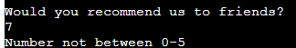

# **A Pawsitively Perfect Survey** - A Milestone Project

## __Introduction__

Hello!

Welcome to a Code Institute milestone project - This is my third project as part of CI's Full Stack Diploma in Software Development.

This project was created with Python3 and is a user survey for the company that my first project was based off; "Pawsitively Perfect Pet Care" (Which is a real company, owned by my mother!)

The purpose of this short survey is to gather responses from customers to establish how happy they are with the service provided by "Pawsitively Perfect Pet Care."

I appreciate you taking the time to look over this project and I am eager to explain more about it below.

[The Live version of this project can be found here.](https://pawsitively-survey.herokuapp.com/)

## __Features__

### __Main Menu__
- App starts with a Welcome message and 3 options.
    - Start
        - Starts Quiz and proceeds onto `Owner Data` function.
    - Instructions
        - Gives a brief explanation of how to complete the survey.
    - About
        - Informs the user why the survey is required.

### __Owner Data__
- Accepts user input:
    - Collection of User's Name & Pet Name.
    - Information stored in a dictionary.

### __Survey Questions__
- User is asked 5 questions.
    - Code loops through questions one at a time.
    - Accepts user input `A number between 0-5`:
        - Correct answer will be added to an empty list.

### __Data Validation__
- User answers to survey questions are checked for incorrect values:
    - If a user provides a non-integer answer, the following error is provided:
        - `This is not a number, please try again.`
    - If a user provides an integer that is below 0 or above 5, the following error is provided:
        - `Number not between 0-5`
    - The question is then looped for the user to provide a valid answer.
    - Once a valid answer has been provided, the loop ends.

### __Final Answers__
- Collective list of answers provided by the user in the `Survey Questions` section.
    - Information is returned to the user in the terminal.

### __Confirm Final Answers__
- Code provides a list of the user's answers from each of the survey questions.
    - if statement requests user to confirm if the final answers are correct, with `y` or `n` (Which stands for yes or no).
        - Function present that will change capitalised answers into lower case to avoid errors.
        - If user answers `y` for yes:
            - Prints a statement thanking the user.
            - Prints a statement telling the user and their pet (data called from Owner Data section) to have a lovely day.
            - Loop ends
        - If user answers `n` for no:
            - All questions from the Survey Questions function are repeated.
        - If user provides an input that is neither yes or no:
            - Code prints a statement that tells the user to please provide a yes or no.

### __External Data Capture__
- At the end of the survey, once the user has confirmed they are happy with their answers by choosing `y`:
    - Answers will be pushed through to an external Google Sheet called `paws_data`
    - This sheet can be accessed 
    - All 5 answers will append a row and stay until an editor removes the values from the sheet.

### __Other Features__
- Other features present in the `Main` function:
    - Print statements:
        - Today's date is printed for user's information.
        - Request for user to answer the below questions.
        - Explanation of how to answer and the 0-5 figures for the answer input (0 = Thoroughly disagree; 5 = Very much agree).
        - Thank you to user for completing the survey.
            - Thank you calls the user's name that they inputted during the `Owner Data` section of the survey.

### __Future Features__
- Capture user's & user's pet details in external Google Sheet.
- Function to confirm if user would like to be contacted after survey completion for further comment; yes or no answers to also be imported into external Google Sheet.

### __External Libraries__
- Three external libraries used in the project:
    - [datetime](https://docs.python.org/3/library/datetime.html)
        - Library was installed via the terminal and then imported in the main code
        - Objects used were `.today` and `.strftime`
            - datetime was used to capture today's date and inform the user within the terminal at the beginning of the survey, so they are aware of the date they have completed the survey on.
    - [gspread](https://docs.gspread.org/en/latest/index.html)
        - Library was installed via the terminal and then imported in the main code
        - gspread was used to help push user data from repo to external google sheet through Python functions.
    - [google auth](https://google-auth.readthedocs.io/en/master/)
        - Library was installed via the terminal and then imported in the main code
        - google auth used to help support accessing Credential API files from Google Cloud.

## __Testing__

- Manual Testing:
    - Provided invalid inputs in each of the validation loops.
        - Examples such as: Strings where numbers expected, inputs out of range, differing inputs from y/n input.
        - Tested in local terminal and the Code Institute Heroku terminal.

- [PEP8 online validation check](http://pep8online.com/)
    - Upon first check, the validator returned 2 yellow errors.
        - This was due to whitespace within the code.
        - This was quickly removed and the code was pushed to github and tested once more through the validation process.
            - The second check came back with an "All right" result.

## __Deployment__
This project was deployed using Code Institute's mock terminal for Heroku.

- **Steps for Heroku deployment:**
    - Fork or Clone [this](https://github.com/LunieLu/pawsitively-survey) repository.
    - Create a new Heroku app.
    - Under the settings tab for the new app, go to the Config Vars section.
    - Add `PORT` in the KEY section and add `8000` into the VALUE section
    - Still in the settings tab, go to the Buildbacks section.
    - Click "Add Buildbacks" and choose `Python` and then `NodeJS` in that order.
    - **Unfortunately Heroku has currently disabled the functionality of connecting to GitHub, so you will need to follow the below steps:**
        - For users without MFA/2FA:
            - Open the Terminal in your Gitpod workspace.
            - Enter the command `heroku login -i` to login to your Heroku account.
            - Enter the command `heroku apps` to get the app name for this repo.
            - Enter the command `heroku git:remote -a app_name` with `app_name` replaced with the app name you created.
            - Add and commit any changes to your code if applicable.
            - Push code to both GitHub & Heroku by using the below commands:
                - GitHub: `git push origin main`
                - Heroku: `git push heroku main`
        - For users with MFA/2FA:
            - Open the Terminal in your Gitpod workspace.
            - Click on Account Settings (under the avatar menu) on the Heroku Dashboard.
            - Scroll down to the API Key section and click Reveal. Copy the key.
            - Back in your Gitpod workspace, enter the command: `heroku_config` , and enter your API key you copied when prompted.
            Enter the command `heroku login -i` to login to your Heroku account.
            - Enter the command `heroku apps` to get the app name for this repo.
            - Enter the command `heroku git:remote -a app_name` with `app_name` replaced with the app name you created.
            - Add and commit any changes to your code if applicable.
            - Push code to both GitHub & Heroku by using the below commands:
                - GitHub: `git push origin main`
                - Heroku: `git push heroku main`
                    - If you get prompted to log in at any point:
                        - Enter your Heroku username.
                        - Enter the API key you just copied.

## __Credits__

- Code Institute for the deployment terminal and template.
- Code inspired by Code Institute's Anna Greaves' "Love Sandwiches" walkthrough project; including main structure and influence for the valid_answers validation loop.
- [datetime external library](https://docs.python.org/3/library/datetime.html) used to call today's date for user information.

## __Acknowledgements__

- As always, I'm thankful to the below groups and people for support during this project:
    - Code Institute's Slack: 
        - Several students helped support me with queries.
    - #london-community Slack Channel:
        - Support, inspiration, shared resources and reviews of code are the main reasons I managed to complete this project.
    - [w3Schools.com](https://www.w3schools.com/default.asp): 
        - For being an amazing font of tutorials and knowledge for new coding students such as myself.